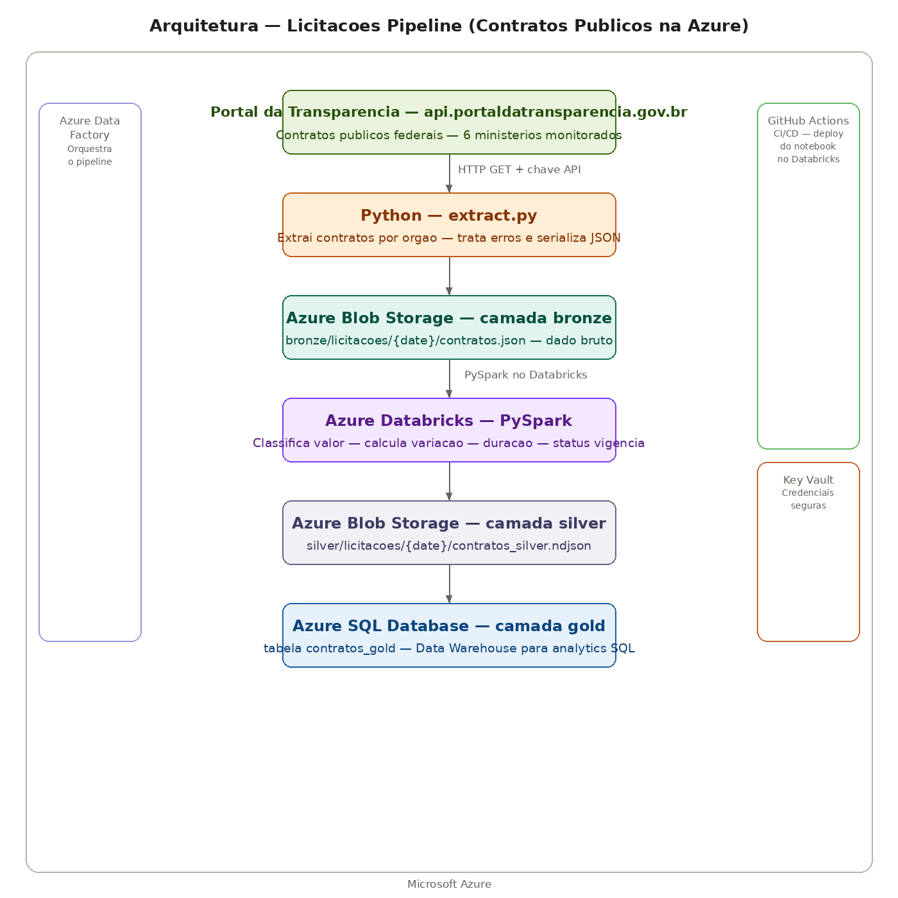

# Licitacoes Pipeline — Contratos Públicos Federais na Azure

Pipeline de dados que extrai contratos públicos federais do Portal da Transparência do Governo Federal, aplica medallion architecture com camadas bronze, silver e gold.

## Arquitetura



**Ingestão:** Script Python extrai contratos de 6 ministérios via API do Portal da Transparência, salvando os dados brutos no Azure Blob Storage na camada bronze.

**Bronze:** Dados brutos em JSON preservados no Blob Storage — garantindo reprocessamento sem nova chamada à API.

**Silver:** Notebook PySpark no Azure Databricks transforma os dados — classifica contratos por valor (pequeno, médio, grande, mega), calcula variação percentual entre valor inicial e final, duração em dias e status de vigência. Salvo como NDJSON no Blob Storage.

**Gold:** Dados modelados carregados no Azure SQL Database via conector nativo do Spark — prontos para consultas SQL analíticas.

**Credenciais:** Azure Key Vault armazena todas as credenciais de forma segura — chave do storage, senha do banco e token da API.

**CI/CD:** GitHub Actions deploya automaticamente o notebook PySpark no Databricks a cada push na pasta pipeline/.

**Infraestrutura:** Toda infraestrutura provisionada via Terraform — Resource Group, Blob Storage, SQL Server, SQL Database, Key Vault, Data Factory e Databricks Workspace.

## Ministérios monitorados

| Ministério | Código |
|---|---|
| Ministério da Fazenda | 25000 |
| Ministério da Saúde | 36000 |
| Ministério da Educação | 26000 |
| Ministério da Infraestrutura | 39000 |
| Ministério da Defesa | 30000 |
| Ministério da Justiça | 52000 |

## Tecnologias Azure

| Serviço | Função | Equivalente AWS | Equivalente GCP |
|---|---|---|---|
| <u>**Azure Blob Storage**</u> | Data Lake bronze e silver | S3 | Cloud Storage |
| <u>**Azure Databricks**</u> | <u>**PySpark distribuído**</u> | EMR | Dataproc |
| <u>**Azure SQL Database**</u> | Data Warehouse gold | RDS | Cloud SQL |
| <u>**Azure Key Vault**</u> | Credenciais seguras | Secrets Manager | Secret Manager |
| <u>**Azure Data Factory**</u> | Orquestração | MWAA | Cloud Composer |
| <u>**GitHub Actions**</u> | CI/CD | CodePipeline | Cloud Build |
| <u>**Terraform**</u> | Infraestrutura como código | Terraform | Terraform |

## Medallion Architecture

**Bronze (Blob Storage):** JSON bruto exatamente como veio da API — encoding preservado, estrutura original intacta.

**Silver (Blob Storage NDJSON):** Uma linha por contrato com métricas calculadas — classificação por valor, variação percentual, duração em dias e status de vigência.

**Gold (Azure SQL Database):** Tabela `contratos_gold` modelada e pronta para consultas analíticas SQL.

## Transformações PySpark — camada silver

- **classificacao_valor** — pequeno (<100k), medio (100k-1M), grande (1M-10M), mega (>10M)
- **variacao_valor** — variação percentual entre valor inicial e final do contrato
- **duracao_dias** — diferença em dias entre início e fim da vigência
- **status_vigencia** — vigente ou encerrado com base na data atual

## Resultado da extração

| Ministério | Valor médio | Total contratos |
|---|---|---|
| Ministério da Educação | R$ 41 milhões | 15 |
| Ministério da Justiça | R$ 3,2 milhões | 15 |
| Ministério da Saúde | R$ 2,9 milhões | 15 |
| Ministério da Fazenda | R$ 501 mil | 15 |
| Ministério da Infraestrutura | R$ 398 mil | 15 |
| Ministério da Defesa | R$ 265 mil | 15 |

## Queries no Azure SQL Database

```sql
-- Top 10 maiores contratos
SELECT TOP 10 orgao_nome, fornecedor_nome, valor_final, classificacao_valor, status_vigencia
FROM contratos_gold
ORDER BY valor_final DESC;

-- Distribuicao por classificacao
SELECT classificacao_valor, COUNT(*) as total, AVG(valor_final) as valor_medio
FROM contratos_gold
GROUP BY classificacao_valor
ORDER BY valor_medio DESC;

-- Contratos vigentes por orgao
SELECT orgao_nome, COUNT(*) as total, SUM(valor_final) as volume_total
FROM contratos_gold
WHERE status_vigencia = 'vigente'
GROUP BY orgao_nome
ORDER BY volume_total DESC;
```

## Como rodar

### 1. Criar infraestrutura Azure
```bash
az login
cd infra
terraform init
terraform apply
```

### 2. Configurar secrets no Databricks
```bash
databricks secrets create-scope --scope licitacoes
databricks secrets put --scope licitacoes --key storage-key --string-value "<storage-key>"
databricks secrets put --scope licitacoes --key sas-token --string-value "<sas-token>"
```

### 3. Rodar extração
```bash
export AZURE_STORAGE_CONNECTION_STRING="<connection-string>"
export PORTAL_API_KEY="<api-key>"
python pipeline/extract/extract.py
```

### 4. Rodar transformação
Execute o notebook `transform_licitacoes` no Azure Databricks.

## Autor

**Lucas Magalhães** — Engenheiro de Dados

[](https://github.com/lucasmagalhaess)
[](https://linkedin.com/in/lucasmagalhaes-data)
